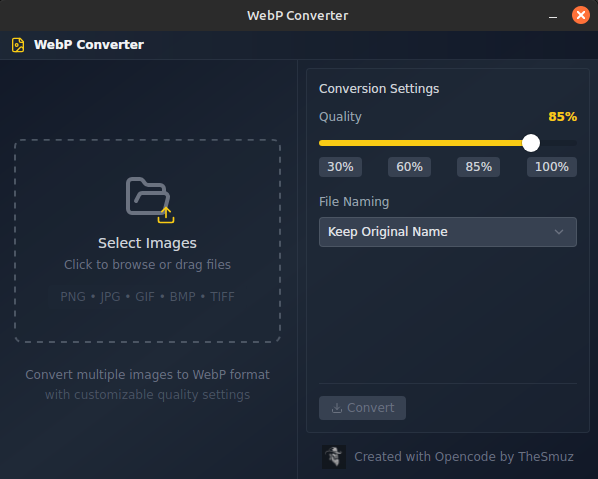

# WebP Converter

A modern, cross-platform desktop application for converting images to WebP format with custom quality settings and batch processing capabilities.




## Features

✨ **Drag & Drop Interface** - Simply drag images into the app or click to browse
🖼️ **Multiple Format Support** - Convert PNG, JPG, JPEG, GIF, BMP, TIFF to WebP
⚡ **Batch Processing** - Convert multiple images at once with parallel processing
🎚️ **Quality Control** - Adjustable quality slider (1-100%) with presets
📝 **Flexible Naming** - Keep original names, add suffix, or use custom patterns
💾 **Instant Download** - Download converted images individually or all at once
🚀 **Fast & Efficient** - Rust-powered backend for optimal performance
📦 **Compact Size** - ~15MB installer size

## Installation

### Prerequisites

- **Node.js** 18+ and npm
- **Rust** 1.70+ and Cargo
- **System dependencies** (Linux only):
  ```bash
  sudo apt-get update
  sudo apt-get install -y libwebkit2gtk-4.1-dev build-essential curl wget file libssl-dev libayatana-appindicator3-dev librsvg2-dev
  ```

### Development Setup

1. Clone the repository:
```bash
git clone <repository-url>
cd webp-converter
```

2. Install dependencies:
```bash
npm install
```

3. Run in development mode:
```bash
npm run tauri dev
```

### Building for Production

```bash
npm run tauri build
```

This will create platform-specific installers in `src-tauri/target/release/bundle/`:
- **Linux**: `.deb` and `.AppImage` files
- **Windows**: `.msi` installer
- **macOS**: `.dmg` installer

## Usage

1. **Add Images**: Drag and drop images or click the drop zone to browse
2. **Adjust Settings**:
   - Set quality using the slider or preset buttons
   - Choose naming scheme (keep original, add suffix, or custom pattern)
3. **Convert**: Click "Convert to WebP" to process all images
4. **Download**: Download individual images or all at once

### Naming Patterns

- **Keep Original**: `image.png` → `image.webp`
- **Add Suffix**: `image.png` → `image_compressed.webp`
- **Custom Pattern**: Use variables like `{name}`, `{index}`, `{date}`

## Technology Stack

- **Frontend**: React + TypeScript + Tailwind CSS
- **Backend**: Rust + Tauri
- **State Management**: Zustand
- **UI Components**: Radix UI
- **Image Processing**: Rust `image` and `webp` crates

## Project Structure

```
webp-converter/
├── src/                    # React frontend
│   ├── components/         # UI components
│   ├── hooks/             # Custom React hooks
│   ├── store/             # Zustand state management
│   └── types/             # TypeScript types
├── src-tauri/             # Rust backend
│   ├── src/
│   │   ├── commands/      # Tauri commands
│   │   └── lib.rs         # Main entry point
│   └── Cargo.toml         # Rust dependencies
└── package.json           # Node dependencies
```

## Performance

- **File Size**: ~15MB installer (vs ~80MB for Electron alternatives)
- **Memory Usage**: ~30-50MB RAM (vs ~150-200MB for Electron)
- **Startup Time**: <1 second
- **Batch Processing**: Parallel conversion using Rust's efficient threading

## Contributing

Contributions are welcome! Please feel free to submit a Pull Request.

## License

MIT License - feel free to use this project for personal or commercial purposes.

## Troubleshooting

### Linux: App doesn't start
Make sure you have all required system dependencies installed (see Prerequisites).

### Windows: Security warning
The app is not code-signed. You may need to click "More info" → "Run anyway" when Windows Defender SmartScreen appears.

### Image conversion fails
- Ensure the image file is not corrupted
- Check that you have write permissions in the download directory
- Try reducing the quality setting for very large images

## Support

For issues, questions, or suggestions, please open an issue on GitHub.